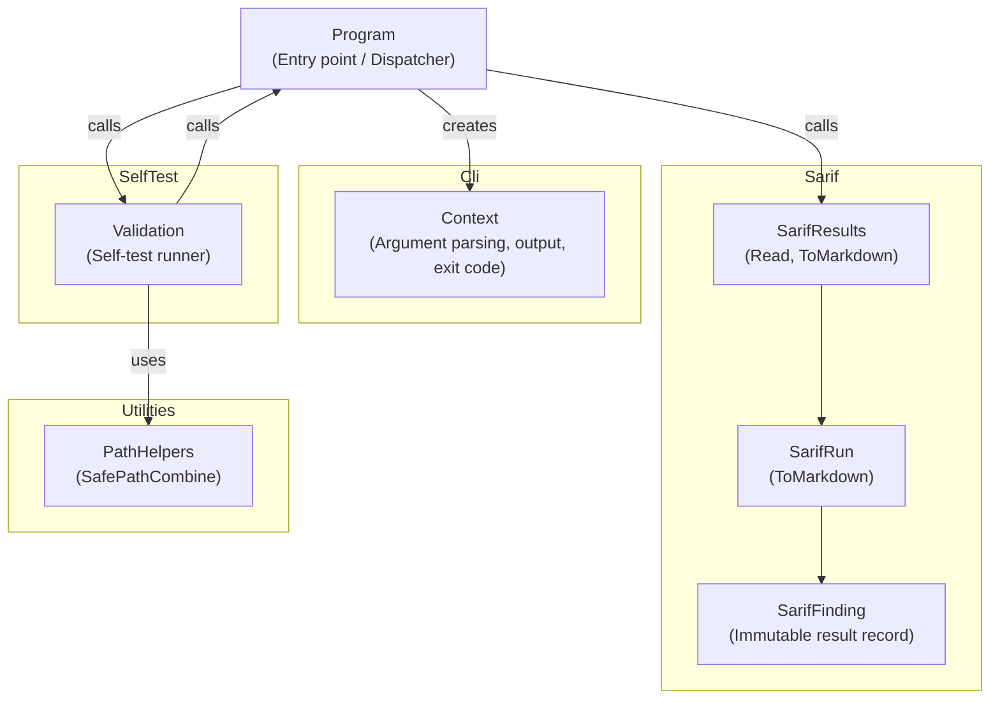

# SarifMark

## Architecture

SarifMark is organized into four subsystems plus a system-level entry point:

`Program` is the system-level entry point and dispatcher. It constructs a `Context`
(via `Cli`) from the command-line arguments, selects the execution mode based on the
parsed flags, and delegates to the appropriate subsystem. The `Sarif` subsystem reads
SARIF 2.1.0 files and generates markdown reports. The `SelfTest` subsystem exercises the
tool's own capabilities to confirm it is functioning correctly. The `Utilities` subsystem
provides path-safety helpers shared across the system.

## External Interfaces

**CLI Arguments**: The command-line interface through which users invoke the tool.

- *Type*: CLI
- *Role*: Provider (the tool accepts arguments from the shell)
- *Contract*: Accepts flags and parameters (`--sarif`, `--report`, `--depth`, `--heading`,
  `--validate`, `--results`, `--enforce`, `--log`, `--silent`, `--version`, `--help`).
  `--report-depth` is a **deprecated** alias for `--depth` and `--result` is a **deprecated** alias
  for `--results`; both are accepted identically to their canonical forms but are intentionally
  omitted from the `--help` output.
  Exits with code 0 on success and 1 on any error or when `--enforce` detects issues.
- *Constraints*: Unrecognized arguments cause an `ArgumentException`, producing exit code 1
  with an error message. Value-bearing flags require a following token.

**SARIF File Input**: The SARIF 2.1.0 JSON files read by the analysis mode.

- *Type*: File
- *Role*: Consumer (the tool reads the file from disk)
- *Contract*: Expects a UTF-8 JSON file conforming to the SARIF 2.1.0 schema with a
  `version` string property and a non-empty `runs` array. Each run must contain a
  `tool.driver` object.
- *Constraints*: File must exist and must be valid JSON. Missing required SARIF properties
  produce `InvalidOperationException` with a descriptive message.

**Markdown Report Output**: The markdown report files written by the analysis mode.

- *Type*: File
- *Role*: Provider (the tool writes the file to disk)
- *Contract*: Writes a UTF-8 markdown file containing a heading, tool attribution, file
  count, issue count, and one line per finding in compiler-style format.
- *Constraints*: Target directory must exist and be writable. I/O errors are caught and
  reported through the CLI output channel.

**Validation Results Output**: TRX or JUnit XML results files written by the validation mode.

- *Type*: File
- *Role*: Provider (the tool writes the file to disk)
- *Contract*: Writes a TRX (VSTest) file when the extension is `.trx`; writes JUnit XML
  when the extension is `.xml`.
- *Constraints*: File extension must be `.trx` or `.xml`; other extensions produce an
  error message. I/O errors are caught and reported through the CLI output channel.

**Log File Output**: The optional log file written when `--log` is specified.

- *Type*: File
- *Role*: Provider (the tool writes the file to disk)
- *Contract*: When `--log <file>` is supplied, every message normally written to the
  console (including error messages) is additionally written as a line to the log file.
  Console output is still written unless `--silent` is also specified, but log file
  output is unaffected by `--silent`.
- *Constraints*: The log file is opened for writing (truncating any existing content)
  before any other processing begins. If the file cannot be opened, an
  `InvalidOperationException` is thrown, reported as an error with exit code 1. The log
  file is flushed after every write and closed when the tool exits.

## Dependencies

- **xUnit v3**: the testing framework used for all automated unit and integration tests —
  see *xUnit v3 Integration Design*
- **BuildMark**: generates build-notes documentation from CI metadata —
  see *BuildMark Integration Design*
- **FileAssert**: validates generated HTML and PDF documents against acceptance criteria —
  see *FileAssert Integration Design*
- **Pandoc**: converts Markdown sources to HTML as part of the documentation pipeline —
  see *Pandoc Integration Design*
- **ReqStream**: enforces that every requirement is linked to passing test evidence —
  see *ReqStream Integration Design*
- **ReviewMark**: generates review plan and review report from the review configuration —
  see *ReviewMark Integration Design*
- **SonarMark**: retrieves and renders SonarCloud quality-gate metrics —
  see *SonarMark Integration Design*
- **VersionMark**: captures and publishes tool-version information —
  see *VersionMark Integration Design*
- **WeasyPrint**: converts HTML documents to PDF —
  see *WeasyPrint Integration Design*
- **DemaConsulting.TestResults**: the OTS package used by the self-validation subsystem to collect, format, and
  serialize test results — see *TestResults Integration Design*
- **SarifMark**: a released version of SarifMark itself, invoked as a shared package in the
  CI pipeline to generate the CodeQL quality report — see *SarifMark Shared Package Integration Design*

## Risk Control Measures

N/A - not a safety-classified software item.

## Data Flow

The primary analysis data flow from SARIF input to markdown output:

1. The shell invokes `Program.Main` with command-line arguments.
2. `Context.Create` parses the arguments, setting mode flags and file paths.
3. `Program.Run` evaluates flags in priority order (version → help → validate → analysis).
4. In analysis mode, `SarifResults.Read` validates the file path, parses the JSON, validates
   the SARIF structure, and constructs an immutable graph of `SarifRun` and `SarifFinding`
   records.
5. `SarifResults.ToMarkdown` traverses the record graph and produces a UTF-8 markdown string.
6. If `--report` was supplied, the markdown string is written to the specified file with
   `File.WriteAllText`.
7. If `--enforce` is set and issues were found, `Context.WriteError` sets the exit code to 1.
8. `Program.Main` returns `Context.ExitCode` to the shell.

The self-validation flow is a separate path in step 3 where `Validation.Run` exercises the
analysis flow end-to-end using a mock SARIF file and verifies the output.

## Design Constraints

- Platform: targets .NET 8, 9, and 10 on Windows, Linux, and macOS.
- Input format: SARIF 2.1.0 JSON only.
- Output format: UTF-8 Markdown for reports; TRX or JUnit XML for validation results.
- No external process invocations at runtime.
- No network access at runtime.
- Heading depth parameter must be an integer between 1 and 6 inclusive.
- All path-combination operations on externally supplied paths use `PathHelpers.SafePathCombine`
  to prevent path-traversal vulnerabilities.

## Error Handling

Errors are handled at three levels:

1. **Argument errors** (`ArgumentException`): thrown by `Context.Create` when the command-line
   arguments are invalid (unrecognized flags, missing values, non-integer depth). Caught in
   `Program.Main` and written to stderr with exit code 1.

2. **Operation errors** (`InvalidOperationException`): thrown by subsystems when a runtime
   precondition fails (e.g., log file cannot be opened, SARIF file is structurally invalid).
   Caught in `Program.Main` and written to stderr with exit code 1.

3. **Unexpected exceptions**: any exception not of the two types above propagates unhandled
   from `Program.Main`, causing the .NET runtime to write a crash report and return a non-zero
   exit code. Unexpected exceptions are intentionally not caught so they surface as unhandled
   errors and aid debugging.

Only `ArgumentException` and `InvalidOperationException` represent expected user-facing error
conditions. All other exception types indicate programming errors or environmental failures that
should not be silently swallowed. See the unit-level Error Handling sections in the
*Program*, *Context*, *SarifResults*, and *Validation* unit design documents for
per-subsystem error-handling detail.

## Report Format

The report format is the system's primary output contract. It defines the structure
and content of the UTF-8 markdown file written when `--report` is specified.

A generated report consists of one or more run sections. For a single-run SARIF file
the output is the run section directly. For a multi-run SARIF file, run sections are
concatenated in order without an extra blank line between them (each run section
already ends with a trailing newline).

Each run section contains the following elements in order:

**Heading line**: A markdown heading at the configured depth (`#` × `depth`),
followed by either the custom heading text (when `--heading` is supplied) or the
default `"[ToolName] Analysis"` label. For multi-run SARIF files each heading is
suffixed with `" (#N)"` where `N` is the 1-based run index.

**Tool attribution line**: `"**Tool:** ToolName ToolVersion"` on its own line,
where `ToolName` and `ToolVersion` are taken from the SARIF `tool.driver` object.

**File count line**: `"**Files:** N"` where `N` is the count of entries in the SARIF
`artifacts` array for that run. `N` is `0` when the array is absent.

**Issues sub-heading**: A markdown heading at `depth + 1` (capped at `6`) titled
`"Issues"`.

**Issues count summary**: `"Found no issues"`, `"Found 1 issue"`, or
`"Found N issues"` reflecting the number of non-suppressed results in that run.

**Result lines**: One line per non-suppressed finding in the form
`"location: severity [ruleId] message  "` (two trailing spaces as a markdown hard
line break). The location prefix follows these rules:

- `"(no location)"` — when the result URI is null, empty, or whitespace
- `"uri"` — when the URI is set but no start line is present
- `"uri(startLine)"` — when both URI and start line are present

Suppressed results — those whose SARIF `suppressions` array is non-empty — are
excluded from the count and do not appear as result lines.

The heading depth parameter must be an integer in `[1, 6]`; values outside this
range cause an `ArgumentOutOfRangeException` reported as an argument error with
exit code 1. The optional custom heading replaces the default
`"[ToolName] Analysis"` label when supplied.

The report format contract is implemented by `SarifResults` (entry point; depth
validation; single-run delegation; multi-run iteration with indexed headings) and
`SarifRun` (per-run formatter; heading, tool attribution, file count, issues
sub-heading, count summary, and one result line per non-suppressed finding) in the
Sarif subsystem.
