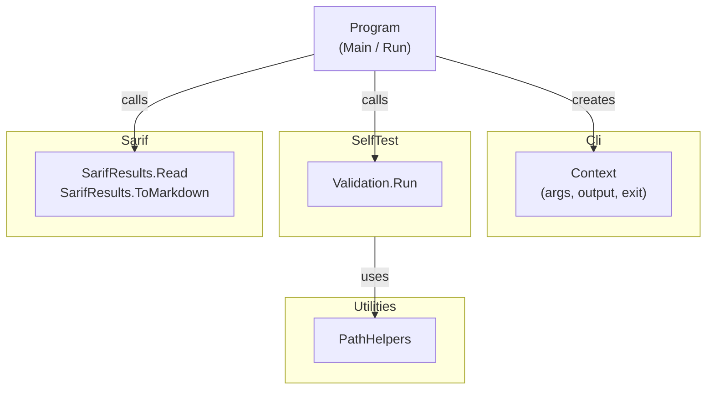

# SarifMark System Design

## Overview

SarifMark is a .NET command-line tool that reads SARIF (Static Analysis Results
Interchange Format) 2.1.0 files and generates human-readable markdown reports.
It is designed for integration into CI/CD pipelines to surface static analysis
findings in pull requests, dashboards, and compliance documentation.

## Subsystems

The system is organized into four subsystems plus a system-level entry point:

| Item          | Type       | Responsibility                                               |
|---------------|------------|--------------------------------------------------------------|
| `Program`     | Unit       | Entry point, argument handling, and subsystem orchestration  |
| `Cli`         | Subsystem  | Command-line argument parsing and console output routing     |
| `Sarif`       | Subsystem  | SARIF file reading and markdown report generation            |
| `SelfTest`    | Subsystem  | Built-in self-validation for tool qualification              |
| `Utilities`   | Subsystem  | Shared utility helpers (safe path combination)               |

See the [Software Structure section of the introduction][introduction] for the
full system/subsystem/unit tree.

## Entry Point and Execution Flow

The system entry point is `Program.Main`. On every invocation it:

1. Constructs a `Context` (owned by the `Cli` subsystem) from `string[] args`.
1. Delegates to `Program.Run`, which selects the execution mode based on the
   parsed flags and calls the appropriate subsystem.
1. Returns `Context.ExitCode` to the shell (0 for success, 1 on error).

`ArgumentException` and `InvalidOperationException` are caught at the
`Main` level and translated to exit code 1, so these expected error paths
produce a non-zero exit code without an unhandled-exception stack trace. Any
other unexpected `Exception` is logged with an "Unexpected error" message and
then rethrown, allowing the default .NET unhandled-exception behavior (stack
trace and process termination with a non-zero exit code) to occur.

`Program.Run` first prints the standard banner for all non-`--version`
invocations, then evaluates conditions in priority order:

| Mode       | Condition                                  | Subsystem Invoked                          |
|------------|--------------------------------------------|--------------------------------------------|
| Banner     | Any non-`--version` invocation (first)     | `Program` (prints standard banner)         |
| Version    | `--version` flag                           | None (prints version string)               |
| Help       | `--help` flag                              | None (prints usage)                        |
| Validate   | `--validate` flag                          | `SelfTest.Validation.Run`                  |
| Analysis   | *(default)*                                | `Sarif.SarifResults.Read` + `ToMarkdown`   |

## Subsystem Interactions

All subsystems receive a `Cli.Context` reference for output. The `Utilities`
subsystem is a stateless helper used by `SelfTest` for path construction.

## System Requirements

System-level requirements are captured in `docs/reqstream/system.yaml`
and are validated through integration tests that exercise the published dotnet
DLL end-to-end across the supported platforms.

[introduction]: introduction.md
